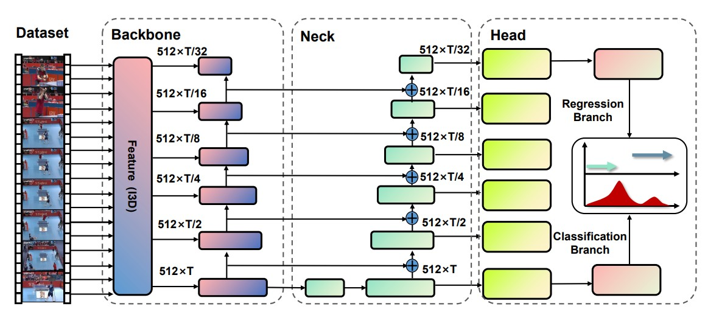

# [TadML: A fast temporal action detection with Mechanics-MLP](https://github.com/BonedDeng/TadML)

By Bowen Deng, Dongchang Liu.

## Introduction

•To the best of our knowledge,TadML achieves state-of-the-art or highly com petitive performance on standard datasets while surpassing the inference speed of previous methods by a large margin and the inference speed on model is astounding 4.44 video per second on THUMOS14.
*•* TadML proves that optical flow data is not indispensable in TAD apllication.Neck layers is the key to improve performance in both RGB stream and two stream.*βGiou* is More suitable for Tad
*•* We first propose a MLP model based on the newtonian mechanics, which prove MLP also suitable for TAD.It achieves highly competitive performance when using RGB and optical flow.



## Updates

---

## TODOs


- [x]  add mlp model code
- [ ] add inference code
- [ ] add training code
- [ ] support training/inference with video input

## Main Results

- THUMOS14

| Type      | Method | RGB stream | 0.3	0.4	0.5	0.6	0.7	Avg |
| --------- | ------ | ---------- | -------------------------------------- |
| One-stage | TadML  | ✓          | 68.78 64.66 56.61 45.40 31.88 53.46    |
| One-stage | TadML  | X          | 73.29 69.73 62.53 53.36 39.60 59.70    |

## Install

### Requirements

```linux
pip install -r requirements.txt
```


## Citing

```
@article{TadML,
  title={TadML: A fast temporal action detection with Mechanics-MLP},
  author={Bowen Deng, Dongchang Liu},
  year={2022}
}
```

## Contact

For questions and suggestions, please contact Bowen Deng.
